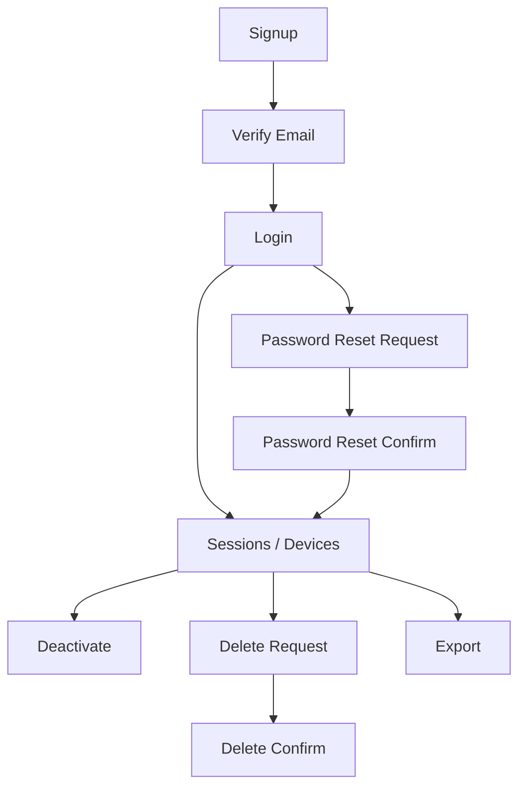

# Account Lifecycle Engine (Signup → Reset → Delete/Export)

Owner: Identity/Account Systems • Privacy/Security  
Applies to: Siddes (Next.js App Router + Django/DRF)

This document is the **single source of truth** for how accounts behave across the full lifecycle:
- account creation
- authentication
- session handling
- password reset
- deactivation
- deletion
- export

It is written to match the current Siddes architecture: **browser → Next proxy → Django**, with **cookie-based sessions**.

---

## 1) System model & trust boundaries

### 1.1 Architecture
- **Browser** communicates only with **Next.js** (same-origin UI + `/api/auth/*` routes).
- Next `/api/auth/*` routes proxy to **Django** `/api/auth/*`.
- Production auth uses Django **SessionAuthentication** + `sessionid` cookie.
- DEV has a stub viewer (`x-sd-viewer` / `sd_viewer`), but **auth endpoints ignore it** and it is **disabled** when `DEBUG=False`.

### 1.2 Critical proxy rule: Next sets the session cookie
The Next proxy **does not rely on backend `Circle-Cookie` for `sessionid`**. Instead, it:
- forwards *non-session cookies* (e.g., `csrftoken`)
- strips backend `sessionid`
- re-sets `sessionid` on the app domain using **`data.session`** from backend JSON (`applyProxyCookies()`)

**Therefore:** any backend endpoint that authenticates a user **MUST** include a `session` payload in JSON.

---

## 2) Data model & account states

### 2.1 Primary models
**Django User**
- `username`
- `email`
- `is_active` (login eligibility)

**SiddesProfile**
- `email_verified`, `email_verified_at`
- `age_gate_confirmed`, `age_gate_confirmed_at`
- `detected_region`, `chosen_region` (coarse country)
- `account_state` ∈ `active | read_only | suspended | banned`
- `account_state_reason`
- `deactivated_at`, `deleted_at`

**Hashed single-use token tables**
- `EmailVerificationToken`
- `PasswordResetToken`
- `MagicLinkToken`
- `EmailChangeToken`
- `AccountDeleteToken`

**UserSession**
- tracks sessions for “logout everywhere”
- `UserSessionCaptureMiddleware` enforces revocation

### 2.2 Definitions
**Deactivate**
- immediate logout + blocks login by setting `user.is_active=false`
- preserves data (no identity scrubbing)

**Delete (soft-delete)**
- immediate logout + blocks login (`user.is_active=false`)
- scrubs identity (username → `deleted_*`, email/name cleared)
- purges contact discoverability tokens/edges

**Export**
- authenticated JSON export of user’s core data

---

## 3) Lifecycle flow map

### 3.1 High-level
create → verify → login → reset → deactivate → delete → export

### 3.2 Flow diagram


---

## 4) Session, cookies, CSRF

### 4.1 Cookie requirements
The session cookie (`sessionid`) MUST be:
- HttpOnly
- SameSite=Lax
- Secure in production
- Path=/

Never store auth tokens in localStorage/sessionStorage.

### 4.2 CSRF contract
- Next provides `GET /api/auth/csrf` to set `csrftoken` on the app domain.
- Frontend adds `x-csrftoken` on unsafe `/api/*` requests.
- Next proxy forwards `cookie`, `x-csrftoken`, `origin`, `referer`.
- In production, CSRF exemptions are disabled.

### 4.3 Session payload contract (MUST)
Any endpoint that creates an authenticated session MUST return:
```json
{
  "session": { "name": "sessionid", "value": "...", "maxAge": 1209600, "expiresAt": "..." }
}
```

---

## 5) Lifecycle flows (endpoints + UX)

### 5.1 Signup
- UI: `/signup`
- Next: `POST /api/auth/signup`
- Django: `POST /api/auth/signup`
  - creates `User` + `SiddesProfile` + default Circles
  - logs in and returns `session`
  - sends verification email best-effort

### 5.2 Verify email
- UI: `/verify-email?token=...` (supports token paste)
- Next: `POST /api/auth/verify/confirm` (applies proxy cookies)
- Django: `POST /api/auth/verify/confirm`
  - validates hashed token (single-use + expiry)
  - sets `email_verified=true`
  - logs in and returns `session`
  - refuses inactive accounts (`account_inactive`)
- Resend: `POST /api/auth/verify/resend` (requires session)

### 5.3 Login
- UI: `/login`
- Password: `POST /api/auth/login` (returns `session`)
- Google: `POST /api/auth/google` (returns `session`)

### 5.4 Password reset
- UI: `/forgot-password` → request
- UI: `/reset-password?token=...` (supports token paste)
- Request: `POST /api/auth/password/reset/request`
  - always returns generic OK (no enumeration)
- Confirm: `POST /api/auth/password/reset/confirm`
  - validates token, sets password, logs in, revokes other sessions
  - returns `session`
  - sends “password changed” security notice best-effort
  - refuses inactive accounts (`account_inactive`)

### 5.5 Magic link sign-in
- Request UI: `/magic-request`
- Consume UI: `/magic?token=...` (supports token paste)
- Request: `POST /api/auth/magic/request` (no enumeration)
- Consume: `POST /api/auth/magic/consume` (returns `session`)

### 5.6 Email change
- Confirm UI: `/confirm-email-change?token=...` (supports token paste)
- Request: `POST /api/auth/email/change/request`
- Confirm: `POST /api/auth/email/change/confirm` (returns `session` with expiry hints)

### 5.7 Sessions / devices
- List: `GET /api/auth/sessions`
- Revoke: `POST /api/auth/sessions/revoke`
- Logout everywhere: `POST /api/auth/sessions/logout_all`

### 5.8 Deactivate
- UI: Settings → Account → Danger Zone
- `POST /api/auth/account/deactivate`
  - sets `user.is_active=false`
  - revokes sessions
  - purges contact discoverability

### 5.9 Delete (soft-delete)
- Request: `POST /api/auth/account/delete/request` (requires verified email)
- Confirm UI: `/confirm-delete?token=...` (supports token paste)
- Confirm: `POST /api/auth/account/delete/confirm`
  - scrubs identity
  - sets `user.is_active=false`
  - revokes sessions
  - purges contact discoverability
- Help: `/legal/account-deletion` (support-assisted)

### 5.10 Export
- UI: Settings → Account → Export
- `GET /api/auth/export?limit=...`
  - returns JSON with `Cache-Control: no-store`

---

## 6) Abuse controls & rate limits

### 6.1 DRF throttles
Anonymous requests key by IP; authenticated key by user id.

Key scopes (defaults; override via env):
- `auth_login`: 20/min
- `auth_login_ident`: 10/min (hashed identifier)
- `auth_magic_request`: 10/hour
- `auth_magic_ident`: 10/hour (hashed email)
- `auth_pw_reset_request`: 5/hour
- `auth_pw_reset_ident`: 10/hour (hashed identifier)
- `auth_pw_reset_confirm`: 30/min
- `auth_verify_confirm`: 30/min
- `auth_verify_resend`: 10/hour
- `auth_account_delete_request`: 5/hour
- `auth_account_delete_confirm`: 30/min
- `auth_export`: 10/min

### 6.2 Token cooldowns
- verify resend: `SIDDES_EMAIL_VERIFY_RESEND_COOLDOWN_SEC`
- reset resend: `SIDDES_PASSWORD_RESET_COOLDOWN_SEC`
- magic resend: `SIDDES_MAGIC_LINK_RESEND_COOLDOWN_SEC`

### 6.3 Privacy-safe suspicious signals
- failure spikes (login / reset)
- token request storms
- session churn
- coarse country change
- high-risk sequence: reset → email change → delete

---

## 7) UX requirements (consistency)

### 7.1 Error mapping (stable codes)
Use these error codes for user-safe messaging:
- `missing_token`, `invalid_token`, `token_used`, `token_expired`
- `weak_password`
- `throttled`
- `restricted`
- `account_inactive`

### 7.2 Token paste fallback (REQUIRED)
The following pages must allow pasting a token (emails already include “paste this token”):
- `/verify-email`
- `/reset-password`
- `/confirm-email-change`
- `/confirm-delete`
- `/magic`

### 7.3 Deletion UX
Danger Zone must:
- recommend “Export data” before delete
- link to `/legal/account-deletion` for users who can’t access the app

---

## 8) Security checklist (launch gate)

### Sessions
- [ ] `sessionid` is HttpOnly + SameSite=Lax + Secure in prod
- [ ] session-creating endpoints return `session` payload (proxy requirement)
- [ ] revoke/logout-all works and is enforced by middleware
- [ ] no auth tokens stored in localStorage/sessionStorage

### CSRF
- [ ] `csrftoken` issued on app domain
- [ ] `x-csrftoken` attached on unsafe requests
- [ ] trusted origins configured for production

### Tokens
- [ ] tokens hashed at rest, single-use, expiry enforced
- [ ] resend cooldowns enforced without leaking account existence

### Privacy
- [ ] contact discoverability purged on deactivate/delete
- [ ] export excludes secrets (password hashes, raw tokens, session keys)

---

## 9) Operational notes
- All `/api/auth/*` responses should include a request id for support (handled by exception handler + proxy).
- Auth logs must never include raw tokens or passwords.

